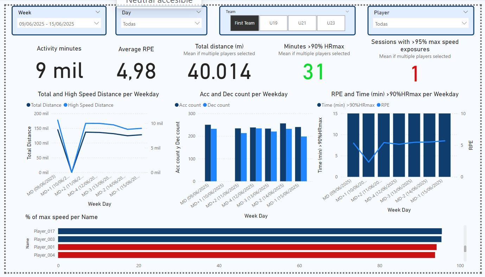

## ⚽ Football Performance Department Data Infrastructure

**From raw GPS and wellness data to automated analytics — simulating a professional football club’s performance ecosystem.**

---

### 🧩 Introduction

In most football clubs, GPS, wellness, and fitness data are managed manually through Excel files exported from tracking systems like **Catapult**, **STATSports**, or **Wimu**.
While functional, this approach becomes inefficient as data grows — leading to **duplications, broken formulas, and inconsistent updates** that compromise long-term analysis.

This project replicates the **data infrastructure of a professional performance department**, showing how **modern data engineering** can transform that fragmented workflow into a **scalable, automated pipeline**.
Built with **Python**, **SQLite**, and **Power BI**, it turns raw CSV exports into a structured SQL database connected to live dashboards — supporting **evidence-based performance decisions**.

---

### 📊 Data and Metric Selection

Synthetic data (provided in the repo) simulate a realistic monitoring setup used in elite football environments.
Metric selection follows the **Quadrant Model** (Buchheit & Laursen, 2024), ensuring coverage of all key physiological domains:

| Quadrant                     | Domain                | Selected Variables                                 | Explanation                                                                          |
| ---------------------------- | --------------------- | -------------------------------------------------- | ------------------------------------------------------------------------------------ |
| **Metabolic Load**           | Internal              | HR Zones (THRZ), RPE                               | Practical and cost-effective proxies for internal load; THRZ used for micro-targets. |
| **Neuromuscular Load**       | Internal & External   | RPE, GPS metrics (distance, HSD, accelerations)    | Pragmatic external load indicators; reproducible without specialized hardware.       |
| **Metabolic Adaptation**     | Response & Adaptation | HR and lactate response in submax test             | Tracks aerobic efficiency without exhaustion.                                        |
| **Neuromuscular Adaptation** | Response & Adaptation | Jump tests (CMJ), isometric strength, bar velocity | Captures neuromuscular adaptation and performance capacity.                          |

> **THRZ (Time in Heart Rate Zones)** is central to the model.
> According to Buchheit et al. (2025), ~30 min/week above 90% HRmax supports aerobic fitness maintenance, with each additional 10 min yielding +1–2% performance gains.

---

### 🧱 Database Design

The database is the **core of the workflow**, ensuring data integrity and traceability.
Raw CSV exports (GPS, wellness, fitness) are unified into a **relational schema** that Power BI can query directly.

**Database Engine:** SQLite (for simplicity; easily scalable to MySQL or PostgreSQL).

**Main Tables:**

| Table             | Content                                          | Purpose                            |
| ----------------- | ------------------------------------------------ | ---------------------------------- |
| `players`         | Player profiles (age, position, anthropometrics) | Reference for all performance data |
| `session_metrics` | GPS & HR data per training session               | Quantifies external/internal load  |
| `wellness`        | Self-reported recovery metrics                   | Monitors well-being                |
| `fitness_tests`   | Periodic testing data                            | Tracks long-term adaptation        |

---

### ⚙️ Scripts Overview

#### `create_db.py`

* Builds the SQLite database (`football_monitoring.db`)
* Creates relational tables
* Imports historical CSV data (players, session metrics, wellness, fitness tests)
* Prepares the database for Power BI connection

#### `update_db.py`

* Automates daily updates
* Moves processed files to `/done`
* Keeps the database synchronized with new CSV exports

#### `Data_generation.ipynb`

* Generates synthetic monitoring data for demonstration purposes

---

### 🔗 Power BI Dashboard

Once the database is built, it connects **live** to Power BI.
Every time new CSVs are added and processed, Power BI can **refresh automatically** to show the latest results.

**Dashboard views include:**

* **Weekly Load Summary** — total minutes, distance, HR zone time, RPE, sprint exposures
* **Training Distance by Day** — load variation across the week
* **Acceleration/Deceleration Profiles** — session intensity overview
* **Internal Load Trends** — RPE vs. HR zone time
* **Speed Exposure Analysis** — % of max speed reached (>95% alerts)
* **Filters** — Week, Day, Team, Player



These visualizations replicate the **data flow of professional performance departments**, enabling coaches and sport scientists to interpret training load and adaptation in real time.

---

### 🔁 Automated Update Workflow

1. Drop new daily CSVs into the project folder
2. Run `update_db.py`
3. Processed files move automatically to `/done`
4. Refresh Power BI to update dashboards instantly


This simulates a **live monitoring ecosystem** used in elite football environments.

---

### 🧠 Summary

This project demonstrates how to build a **scalable and reproducible data pipeline** for sports performance monitoring:

✅ Transform raw CSV exports into a relational SQL database
✅ Automate ETL processes with Python
✅ Connect to Power BI for interactive dashboards
✅ Mirror real-world data workflows used in professional clubs

> It bridges **data engineering and sports science**, turning static spreadsheets into an **intelligent, automated performance monitoring system**.

---

### 🧩 Tech Stack

* **Python 3.11+**
* **SQLite**
* **Pandas / SQLAlchemy**
* **Power BI**
* **Jupyter Notebook**

---

### 📚 References

* Buchheit, M., Akubat, I., Ellis, M., Campos, M., Rabbani, A., Castagna, C., & Malone, S. (2025). *Revisiting dose–response relationships between heart rate zones, TRIMPs, and aerobic-related markers in elite team sports.* Sport Performance & Science Reports, 269, v1.
* Buchheit, M., & Laursen, P. B. (2024). *Data everywhere, insight nowhere: A practical quadrant-based model for monitoring training load vs. response in elite football.* Sport Performance & Science Reports, 259, v1.

---

### 🧾 Repository Structure

```
├── create_db.py
├── update_db.py
├── Data_generation.ipynb
├── players.xlsx
├── session_metrics.xlsx
├── wellness.xlsx
├── fitness_tests.xlsx
├── requirements.txt
├── done/
├── venv/               ← (excluded via .gitignore)
├── PowerBI_dashboard.pbix
└── ReadMe.md
```
